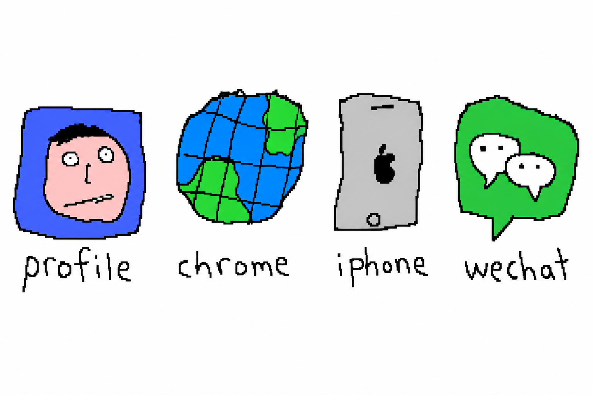

# wechat-use

<p align="center">
  
</p>

<p align="center"><sub><i>是的，logo 就长这样。鼠标在画图程序里蹭的，将就看。</i></sub></p>

把 macOS 上的微信变成给 AI agent / bot 用的**本地 API**。
不上云、不上 iPad 协议、纯本地实现,数据只在你这台 Mac 上动。

> `wechat-use` 是 **`*-use` 系列**的一员——让 AI agent 直接操作你本地真实工具 / 设备:
> [`profile-use`](https://github.com/leeguooooo/profile-use)(本地个人资料填表) ·
> [`iphone-use`](https://github.com/leeguooooo/iphone-use)(驱动真 iPhone) ·
> `chrome-use`(浏览器,规划中) · **`wechat-use`**(macOS 微信)。
> 统一定位:**本地优先、不上云、用户完全掌控数据**。

<p align="center">
  
</p>

<p align="center"><sub><i>一家四口，谁也别嫌谁画得丑。</i></sub></p>

> **支持微信 4.0.x / 4.1.x 系列**。具体版本兼容矩阵以 `wechat-use doctor` 输出为准;WeChat 热更后通过 profile API 推送适配数据,**无需重发 release**。
>
> **命令名**:主命令是 `wechat-use`;装好后 `wechat` 是它的等价别名(`wechat-use send …` ≡ `wechat send …`),老脚本无需改动。

### 功能

- 💬 发消息（后台零闪屏）+ **@ 真红点**提醒
- 📜 读消息 / 历史 + 全文搜索（FTS）+ 导出
- 👥 联系人 / 群 / 会话（群名自动解析）
- 🟢 朋友圈（只读）· ⭐ 收藏 · 🖼 图片（heap 直读 + CDN 回源）
- 🎙 语音消息转文字（whisper 本地转写）
- ↩️ 撤回消息归档恢复
- 🛰 daemon + `listen` 实时收消息 · 🔌 HTTP bridge（REST）· 🤖 Wechaty puppet gateway（gRPC）
- 🔀 多账号 / 多版本并存（`--bundle-id` 路由）

### 版本兼容

| WeChat 版本 | 取 key | 消息/历史 | 联系人/群 | 朋友圈 | 收藏 | 图片 | 语音转写 | 撤回归档 | 发消息 | @ 红点 |
|---|---|---|---|---|---|---|---|---|---|---|
| 4.0.x | ✅ | ◐ | ◐ | ◐ | ◐ | ◐ | ◐ | ◐ | ⚠️ | ⚠️ |
| 4.1.7 / 4.1.8 | ✅ | ✅ | ✅ | ✅ | ✅ | ✅ | ✅ | ✅ | ✅ | ✅ |
| 4.1.9 | ✅ | ✅ | ✅ | ✅ | ✅ | ✅ | ✅ | ✅ | ✅ | ✅ |
| 4.1.10 | ✅ | ✅ | ✅ | ✅ | ✅ | ◐ | ◐ | ◐ | ✅ | ✅ |

> **图例**:✅ 已实测/已验证 · ◐ 取 key 后应可读(读类功能基于解密 DB,设计上版本无关),本轮未在该版本逐项实测 · ⚠️ 视具体小版本。
> 随版本变化的主要是「取 key 方法」和「发消息 / @」(需按版本逆向);读类功能取到 key 后基本通用。


> **4.1.10 已支持**（v1.16.47+）:`init` 自动取 key + 发消息 + @ 真红点全部打通。4.1.10 首次 `init` 会请你重开一次 WeChat 并点开通讯录/几个聊天(约 25 秒)，用于抓取各库 key。
>
> 具体以 `wechat-use doctor` 输出为准;WeChat 热更后通过 profile API 推送适配数据,**无需重发 release**。

---

## 5 秒看明白

按吸引力挑一个进入:

- **AI agent / IDE 用** ([SKILL.md](./SKILL.md))
  Claude Code / Codex / Cursor 直接学会发消息、查记录、收消息流。
- **命令行 / shell 脚本**
  `wechat-use send / sessions / listen` — cron 和管道友好。
- **任意 [wechaty](https://github.com/wechaty/wechaty) bot** (TS / Python / Go)
  `wechat-wechaty-gateway` (gRPC :18401) — 首个真号 wechaty macOS 协议,bot 零改动跑在自己微信上。
- **HTTP 风格 agent 平台** (Hermes / n8n / Dify / LangChain)
  `wechat-bridge` (HTTP + SSE :18400) — WeChat 变成跟 WhatsApp / Slack 同 shape 的本地接口。
- **接入自己 SaaS / CF Worker**
  `wechat-use orchestrate` (NAT-friendly poll) 或 `wechat-use tunnel` (CF Tunnel + JWT) — 远程驱动本机微信。

> 所有 surface 共享同一个 daemon + 同一个激活码,**装一次全开**。

---

## 装一下(5 分钟)

### 1. 拿激活码

跟 [@WechatCliBot](https://t.me/WechatCliBot) 私聊 → `/start` → 「📝 申请激活码」→ 写一行**个人用途**说明 → 通过后机器人发你 `wechatuse_xxxxxx`。
前置:关注频道 <https://t.me/+4PuAO3lB9R82ZTVh>。审核 1-24h,[为什么走审核制](./docs/why-activation.md)。仅个人研究用途,任何商业 / 对外服务场景**不予发放**。

### 2. 装 CLI

```bash
curl -fsSL https://raw.githubusercontent.com/leeguooooo/wechat-use/main/install.sh | bash
```

确认 `~/.local/bin` 在 `PATH` 里(fish: `fish_add_path $HOME/.local/bin` / zsh: `echo 'export PATH="$HOME/.local/bin:$PATH"' >> ~/.zshrc`)。

### 3. 按这个顺序跑(install.sh 输出末尾也会重述一遍)

```bash
# 1) 输入激活码
wechat-use auth activate wechatuse_xxxxxx

# 2) ⚠️ 授权 wechat-bridge 进「辅助功能」(macOS Sonoma+ 强制,不做 send 静默失败)
#    install.sh 跑完会自动打开「系统设置 → 隐私与安全性 → 辅助功能」并定位到二进制路径
#    把 /Users/<you>/.local/bin/wechat-bridge 拖进去勾上即可
#    详细 + TCC 故障 → docs/install.md#tcc

# 3) 体检(任何时候出问题先跑这个)
wechat-use doctor

# 4) 抽数据库 key (自动按 WeChat 版本适配)
wechat-use init

# 5) ⚠️ warmup —— 在 WeChat 客户端里【手动】给文件传输助手发一条消息(随便打个 "1" 都行)
#    发送路径只在用户首次手动 send 之后才完全 wired,daemon 重启 / 升级后也要重做。
#    不做的话 step 6 第一次会失败。详见 docs/troubleshooting.md#warmup

# 6) 自测发消息 —— filehelper 是微信「文件传输助手」的 wxid,给自己发,看得到说明 send 通了
wechat-use send "Hello 🎉" filehelper
```

> ❗ 不要先跑 `wechat-use init` 再 `wechat-use auth activate` ——init 不需要激活码能跑通,但是 send / sessions / 等查询命令都需要激活,顺序反了会让你在 step 6 才发现没激活。

---

## 命令行用法

```bash
# 发消息(recipient 可以是 wxid / 昵称 / 备注 / 群名)
wechat-use send "你好" 张三                # 找不到联系人会列出候选,不会静默
wechat-use send "Hello 🎉" filehelper     # filehelper = 微信「文件传输助手」,自测最佳目标
wechat-use send "test" "李工" --dry-run    # 验证 fuzzy match 但不真发,适合 agent 写脚本前确认

# 查聊天
wechat-use sessions                       # 最近 20 个会话(完整 yaml)
wechat-use sessions --brief -n 10         # 单行 / 会话,带未读数,适合快速浏览
wechat-use contacts --brief -n 20         # 单行 / 联系人 (姓名 + wxid)
wechat-use unread -n 5                    # 有未读的
wechat-use history "张三" -n 50            # nickname / 群名也行,跟 send 一样会解析
wechat-use history --chat 21263894984@chatroom -n 50  # 也支持 --chat
wechat-use search "会议" --in "项目讨论组"  # --in 同样解析昵称 / 群名

# 收消息流(agent 神器)
wechat-use listen --wxid filehelper
wechat-use listen --on-message ./reply.sh

# 语音消息自动转文字 (v1.13.25+)
wechat-use audio setup                    # 一次性装齐 ffmpeg/whisper.cpp/silk-decoder/medium 模型
wechat-use history "群名" -n 50            # 默认 transcribe 语音 → display_text,agent 看历史不再卡 [语音消息]
wechat-use audio transcribe <svr_id>      # 单条转写

# 自检
wechat-use doctor                         # 任何问题先跑这个
wechat-use auth status                    # 第一行直接告诉你「剩余 X 天」
```

完整能力矩阵 → [docs/capabilities.md](./docs/capabilities.md)。

---

## 接 AI agent

**A. Claude Code / Codex / Cursor** — `npx skills add leeguooooo/wechat-use -y -g`,agent 读 [SKILL.md](./SKILL.md) 自动学会全部命令。先装 CLI 再装 skill。

**B. wechaty bot(任意语言)** — `wechat-wechaty-gateway` 起 gRPC :18401,任意 wechaty 1.x 客户端零改动接入 (`puppet: 'wechaty-puppet-service'` + `endpoint: '127.0.0.1:18401'`)。例子:[`examples/`](./examples/)(echo / mention-only / LLM bot / CF Worker bot)。

**C. HTTP / SSE bridge** — `wechat-bridge` 起 HTTP+SSE :18400,8 个稳定路由,可加 `--shape hermes` 跟 Hermes WhatsApp-bridge 同 shape 零适配。SSE schema → [`wx/schema/sse-payload-v1.10.28.schema.json`](./wx/schema/sse-payload-v1.10.28.schema.json)。

**D. 远程驱动**:
- `wechat-use orchestrate setup` — Mac 全 outbound poll SaaS outbox,**不需公网 IP / 域名**(家用宽带 / 公司内网 / GFW 后面都行)→ [docs/v1.12-orchestrate-protocol.md](./docs/v1.12-orchestrate-protocol.md)
- `wechat-use tunnel setup` — Cloudflare Tunnel 暴露 + JWT 同步调,适合 CF Worker 偶发触发 → [docs/remote-gateway.md](./docs/remote-gateway.md)

---

## 出问题 / 安全 / 平台

<p align="center">
  
</p>

<p align="center"><sub><i>数据不上云。云被划掉了。就这台破电脑。</i></sub></p>

- **排错**:`wechat-use doctor` 看哪一项 ✗ → 整段输出 + 报错描述提 [GitHub issue](https://github.com/leeguooooo/wechat-use/issues/new)。详细 → [docs/troubleshooting.md](./docs/troubleshooting.md)
- **安全**:聊天 / 联系人 / key / wxid **永不出本机**;只向 profile API 上报当前 WeChat 指纹拉适配数据。`~/.wx-rs/` 下的 key 文件已 chmod 600,**绝不要**贴 git / pastebin / 群聊。激活码 token 进 macOS Keychain。不改 WeChat.app 二进制,只 ad-hoc 加 `get-task-allow` entitlement
- **平台**:macOS Apple Silicon。支持 WeChat **4.0.x / 4.1.x 系列**(具体版本以 `wechat-use doctor` 输出为准)。`wechat-use init` 自动按版本适配。WeChat 热更后通过 server-side profile 推送新版本适配数据,**无需重发 release**

---

## 使用风险

本工具操作的是**你自己的** WeChat 账号。WeChat 的风控系统对异常行为会触发限制甚至封号——这跟工具本身无关,正常人用 WeChat 做同样的事一样会被风控。

**风险分级**

| 用法 | 风险 |
|---|---|
| 个人自用、人类频率、给自己 / 熟人 / 文件传输助手发消息 | 跟正常用 WeChat 一致 |
| daemon 24/7 监听消息流、偶发自动回复 | 低 |
| 高频加好友 / `searchcontact` 陌生人 | **高,会触发 24h 风控** |
| 群发 / 营销 / 自动 @ all / 跨号操作 | **极高,封号** |

**建议**
- 个人自用、不做营销 → 放心用
- **不要**拿去跑加好友机器人、群发机器人、对外 SaaS 客服
- WeChat **大版本**升级(4.1.x → 4.2.x 这种,不是 build 热更)后等本项目适配再用,本项目与 WeChat 官方无任何关联,出新版本我们也是事后才知道
- 重签 WeChat.app 改了官方分发包签名,由使用者**自行承担**风险

详细法律 / 道德条款见 [DISCLAIMER](./DISCLAIMER.md)。

---

## 关于 fork / Notice to forks

**`github.com/leeguooooo/wechat-use` 的 `main` 分支是本项目唯一权威版本。**任何 fork 副本、第三方镜像、归档快照里的 README / commit 历史 / release notes / issues 都**不代表本项目当前立场**——尤其是早于 [`1497b15`](https://github.com/leeguooooo/wechat-use/commit/1497b15)(2026-05-19)之前的快照,其内容已被本仓主动 redact / 删除,以更准确地反映本项目作为**个人研究、永久免费、非商业**工具的实际定位。

所有 fork、镜像、衍生作品**继续受 [LICENSE](./LICENSE) 与 [DISCLAIMER](./DISCLAIMER.md) 约束**,任何商业使用、转售、SaaS 集成、付费分发均**不被许可**。若你持有本项目的 fork 副本,请**从 upstream 同步到最新版本**(GitHub → Sync fork)或**删除副本**;陈旧副本的内容不应被援引为本项目的立场或行为。

**The `main` branch of `github.com/leeguooooo/wechat-use` is the sole authoritative version of this project.** README / commit history / release notes / issues in forks, mirrors, or third-party archives — especially snapshots predating [`1497b15`](https://github.com/leeguooooo/wechat-use/commit/1497b15) (2026-05-19) — do not represent this project's current position. Forks remain bound by [LICENSE](./LICENSE) and [DISCLAIMER](./DISCLAIMER.md). If you hold a fork, please sync it from upstream or delete it; outdated copies should not be cited as the project's position.

---

## 文档

- [docs/why-init.md](./docs/why-init.md) — init 在干嘛
- [docs/why-activation.md](./docs/why-activation.md) — 审核制理由
- [docs/capabilities.md](./docs/capabilities.md) — 完整能力矩阵
- [docs/install.md](./docs/install.md) — 详细安装 / TCC / 多账号 / LaunchAgent
- [docs/troubleshooting.md](./docs/troubleshooting.md) — 热更 / 签名 / 0 hits 等
- [docs/v1.12-orchestrate-protocol.md](./docs/v1.12-orchestrate-protocol.md) / [docs/remote-gateway.md](./docs/remote-gateway.md) — 远程驱动两条路
- [docs/CHANGELOG.md](./docs/CHANGELOG.md) / [docs/ROADMAP.md](./docs/ROADMAP.md)

### 深入原理

- [让微信在后台替你发消息,我曾经把它的数据库搞坏 —— 从「挂调试器」到「零附着」](https://blog.leeguoo.com/zh/posts/wechat-macos-noattach-send/) — 后台 send 为什么会弹「数据库已损坏」,以及怎么把 LLDB 断点写内存换成 `mach_vm_write` 做到全程不附着

---

## License + 免责

[非商业自研协议](./LICENSE) + [DISCLAIMER](./DISCLAIMER.md)。**仅限**个人学习 / 研究 / 对本人账号的个人自动化。

本工具基于 macOS 公开调试接口实现,与 WeChat 官方无任何关联,也**不提供任何形式的商业授权、批量分发、SaaS 合作、对外有偿服务**——相关咨询恕不回应。**严禁**用于商业用途 / 群发营销 / 刷单 / 自动化非本人账号 / 爬取或监控他人数据。使用即表示用户**自行承担全部风险**(含微信账号被限制 / 封禁的可能)。
---

> Built by **leeguooooo** — field notes on AI agents, reverse engineering & Cloudflare Workers at **[blog.misonote.com](https://blog.misonote.com)** · follow on **[X @leeguooooo](https://x.com/leeguooooo)**
